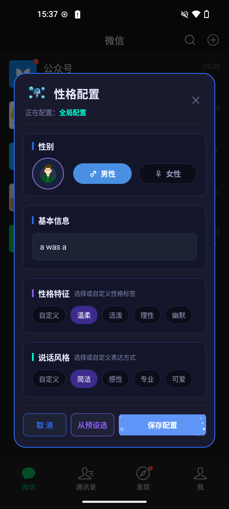
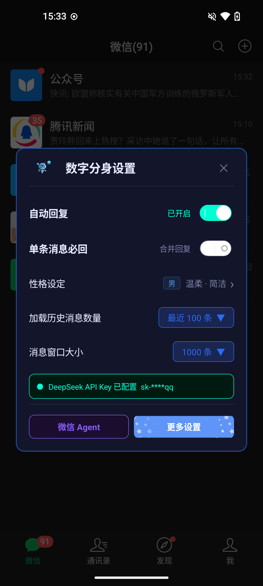
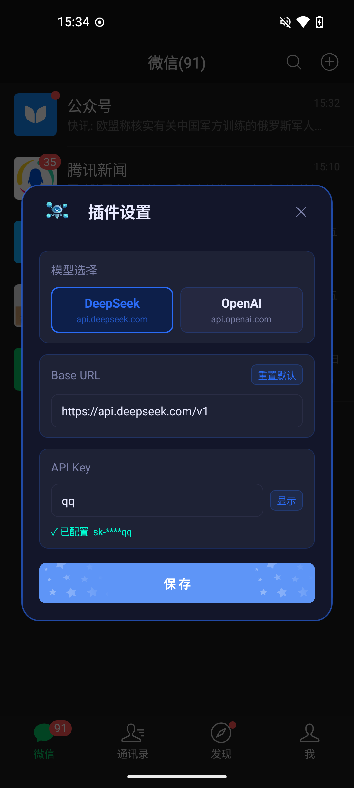
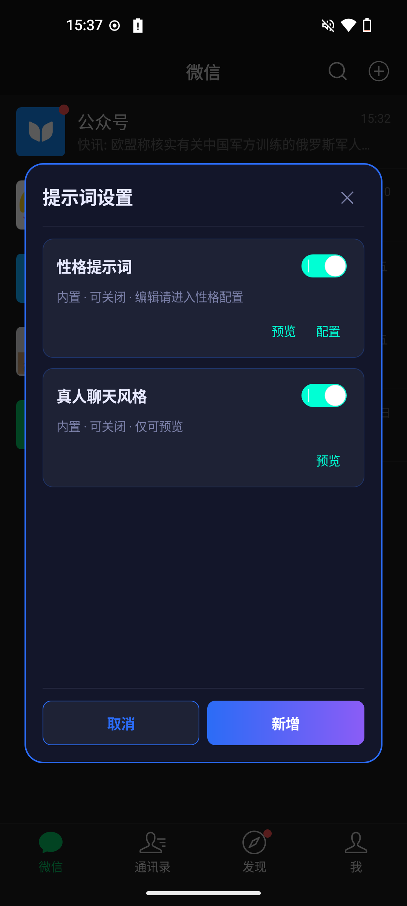

# 🤖 微信 Agent

微信 Agent 是一款运行在微信内的个人 AI 助手模块。它可以接入 DeepSeek、OpenAI 等大模型，连接自定义 MCP 服务，并结合微信上下文完成自动回复、联系人整理、群聊分析、聊天记录查询、文件导出和消息发送等任务。

`AI 助手` · `自动回复` · `微信数据整理` · `MCP 工具扩展` · `WeChat 8.0.74`

> **需要功能定制请联系：wechatagent666@gmail.com**

## ✅ 版本兼容

| 微信 Agent 版本 | 兼容 WeChat 版本 | 说明 |
| --- | --- | --- |
| 1.1.2 | 8.0.74 | 新增日志回捞能力，支持 Java/native xlog 与模块日志收集导出 |
| 1.1.1 | 8.0.74 | 新增微信综合工具，支持联系人备注名查询和修改 |
| 1.1.0 | 8.0.74 | 适配 WeChat 8.0.74，新增默认自动回复和单独配置能力 |
| 1.0.1 | 8.0.72 | 优化 View 注入和事件分发逻辑 |
| 1.0.0 | 8.0.72 | 初始版本，支持微信 Agent、自动回复、MCP 工具和微信数据整理 |

## 📝 更新内容

### 1.1.2

- 新增日志回捞能力，可在更多设置中开启或关闭日志收集。
- 新增日志导出分享能力，可将当前日志数据库打包为 zip 后导出或分享。
- 日志按天独立数据库文件存储，并在启动时清理过期日志文件。

### 1.1.1

- 新增微信综合工具能力，微信 Agent 可根据你的明确指令查询或修改联系人备注名。
- 联系人备注名修改走微信内部资料保存流程，降低直接写数据库导致缓存不同步的风险。
- 新增联系人备注名查询能力，可通过微信内部 username 查看当前备注名。
- 优化 Agent 工具注册逻辑，微信综合工具会自动加入微信 Agent 可用能力。
- 提升微信 Agent 最大执行步骤上限，复杂任务和多工具调用更不容易中途失败。
- 补充版本兼容与使用说明文档，方便查看历史版本支持情况。

### 1.1.0

- 适配 WeChat 8.0.74，并在模块加载时增加版本兼容校验。
- 新增默认自动回复策略，可控制未单独配置的联系人或群聊是否默认回复。
- 新增自动回复「单独配置」列表，支持按群组和联系人分别开启或关闭自动回复。
- 优化自动回复并发处理，同一用户/群的 Agent 回复按顺序执行，避免重复任务互相打断。
- 优化消息发送队列，发送消息按顺序执行，降低连续发送导致的不稳定风险。
- 优化 Agent 工具调用展示，长内容支持折叠/展开，阅读和调试更清晰。
- 更新用户使用说明、功能展示和发布文档。

### 1.0.1

- 优化 View 注入和事件分发逻辑。

### 1.0.0

- 初始版本，支持微信 Agent 对话、自动回复、MCP 工具配置和微信数据整理能力。

## 🖼️ 功能展示

| 微信 Agent | 自动回复性格设置 | 数字分身设置 |
| --- | --- | --- |
|  |  |  |
| AI 配置 | 提示词设置 | MCP 服务配置 |
|  |  |  |

## ✨ 核心能力

### 💬 AI 聊天助手

在微信内直接和 Agent 对话，用自然语言查询联系人、群聊、聊天记录，或让 AI 帮你整理、总结、导出结果。

### 🔁 自动回复

支持私聊自动回复、群聊 @ 后回复、当前会话单独关闭、联系人专属风格、单条消息必回和上下文读取策略。

### 👥 联系人和群聊整理

支持查询双向好友、未备注好友、黑名单、异常联系人、联系人备注名、群聊列表、群成员、群活跃度和近期聊天主题。你明确确认后，也可以让 Agent 修改联系人备注名。

### 🔎 聊天记录查询

支持按联系人、群聊、关键词、消息类型和时间范围查询历史聊天记录，并可生成摘要或报告。

### 📄 文件导出

查询结果较多时，可以导出为 CSV、Markdown 或文本文件，便于后续查看、分享和归档。

### 📤 微信消息发送

在你明确要求时，可以发送文本消息、引用回复、群聊 @、本地图片、本地文件和联系人名片。

### ✍️ AI 文本内容润色

支持手动发送文本前由 AI 优化表达，可配置是否直接发送、确认弹窗、自定义提示词和预设风格。

### 🧰 日志回捞

支持按开关收集微信 Java/native xlog 与模块自身日志，并将日志数据库打包导出，方便定位兼容性和运行问题。

### 🔌 MCP 工具扩展

支持配置自定义 MCP 服务，为 Agent 增加联网搜索、第三方 API、自建工具服务等能力。也可以从 ModelScope MCP 市场查找可用服务：

[https://modelscope.cn/mcp](https://modelscope.cn/mcp)

## 🚀 快速开始

1. 安装并启用 LSPosed 模块。
2. 确认微信版本为 `8.0.74`。
3. 打开微信内插件入口，进入 AI 控制面板。
4. 配置模型类型、API Key 和 Base URL。
5. 打开微信 Agent，输入任务开始使用。
6. 如需自动回复，在控制面板中开启自动回复并配置回复风格。

## 📖 使用文档

完整使用说明请查看：

[需求描述/用户使用说明/用户使用说明.md](需求描述/用户使用说明/用户使用说明.md)

文档包含：

- 版本兼容说明
- 快速开始
- 功能展示
- 自动回复配置
- 提示词和数字分身配置
- MCP 服务配置
- 常见问题
- 注意事项和免责声明

## ⚠️ 注意事项

- 当前版本仅适配 WeChat `8.0.74`。
- AI 可能理解错误，重要操作请自行确认。
- 自动回复会影响真实聊天体验，建议先小范围测试。
- 发送消息、文件、图片、名片和修改联系人备注名都是真实操作。
- 查询微信数据只应服务于你自己的使用需求。
- 使用 MCP 市场服务时，请确认服务来源、权限和 token 使用范围。

## 📌 免责声明

本项目仅用于个人学习、研究和自用场景。使用者应自行确认所在地区、平台规则及相关法律法规要求，并对自己的使用行为负责。

本项目不会主动承诺对任何第三方服务、模型服务、MCP 服务或微信版本的长期兼容性。由于微信版本更新、系统环境差异、LSPosed 环境差异、模型输出不确定性或外部服务不可用导致的问题，需由使用者自行评估和处理。

涉及自动回复、消息发送、文件发送、联系人查询、聊天记录查询等能力时，请确保你拥有相应数据和操作权限，并在重要操作前进行人工确认。

## 📮 反馈与联系

如果你遇到 Bug、兼容性问题或有功能建议，可以在 GitHub 仓库提交 Issues：

[makeloveandroid/WechatAgent](https://github.com/makeloveandroid/WechatAgent)

也可以通过邮箱联系：

```text
wechatagent666@gmail.com
```
