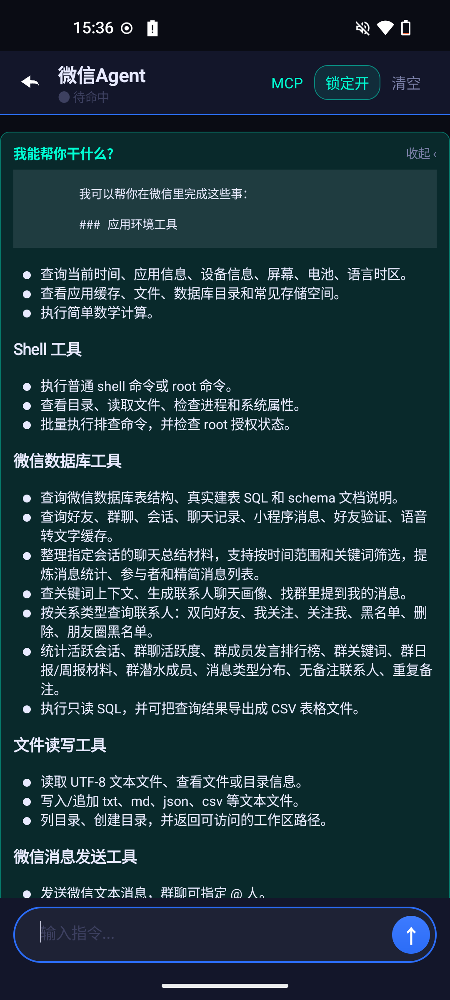
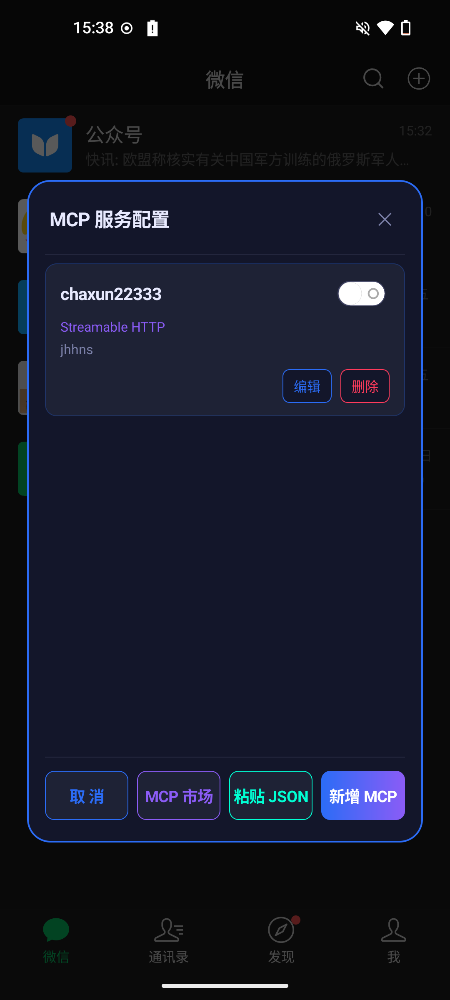

# 🤖 微信 Agent 用户使用说明

微信 Agent 是一款运行在微信内的个人 AI 助手模块。它可以接入 DeepSeek、OpenAI 等大模型，连接自定义 MCP 服务，并结合微信上下文完成自动回复、联系人整理、群聊分析、聊天记录查询、文件导出和消息发送等任务。

它不是用来替代你聊天的工具，而是一个可以理解微信数据、调用本地能力和外部工具、辅助你处理微信事务的个人智能体。

`AI 助手` · `自动回复` · `微信数据整理` · `MCP 工具扩展` · `WeChat 8.0.72`

> **需要功能定制请联系：wechatagent666@gmail.com**

## ✅ 版本兼容

| 微信 Agent 版本 | 兼容 WeChat 版本 | 说明 |
| --- | --- | --- |
| 1.0.0 | 8.0.72 | 当前版本基于 WeChat 8.0.72 适配 |

## 🎯 适用场景

- 希望用 AI 辅助处理微信联系人、群聊和聊天记录。
- 希望自动回复私聊或群聊中的指定消息。
- 希望将微信数据整理成 CSV、Markdown 或文本文件。
- 希望通过 MCP 接入联网搜索、第三方 API 或自建工具服务。
- 希望在微信内直接和一个具备工具调用能力的 Agent 对话。

## 🖼️ 功能展示

| 微信 Agent | 自动回复性格设置 | 数字分身设置 |
| --- | --- | --- |
|  |  |  |
| AI 配置 | 提示词设置 | MCP 服务配置 |
|  |  |  |

## 🚀 快速开始

### 1. ⚙️ 配置 AI 模型

进入 AI 配置页面，填写模型服务信息：

| 配置项 | 说明 |
| --- | --- |
| 模型类型 | 支持 DeepSeek、OpenAI 等模型服务 |
| API Key | 模型服务提供的访问密钥 |
| Base URL | 模型服务地址，使用官方地址或兼容接口地址 |

配置完成后，微信 Agent 和自动回复都会使用该模型能力。

### 2. 💬 打开微信 Agent

在微信内打开插件入口，进入微信 Agent 对话界面。你可以像聊天一样输入任务，例如：

```text
帮我查一下我有哪些群聊
```

```text
帮我找出没有备注名的好友，并导出成表格
```

```text
帮我总结一下这个群最近 7 天在聊什么
```

Agent 执行任务时会展示当前状态、过程分析、工具调用、工具结果和最终回复。

### 3. 🔁 开启自动回复

在 AI 控制面板中开启自动回复后，AI 会根据你的配置和聊天上下文生成回复。

自动回复支持：

- 私聊自动回复
- 群聊自动回复
- 当前会话单独关闭
- 每个联系人或群配置独立回复风格
- 单条消息必回策略
- 读取最近聊天上下文辅助回复

群聊默认只在别人 @ 你时回复，避免 AI 在群里频繁插话。

### 4. 🧠 配置提示词和数字分身

提示词决定 AI 的身份、语气、边界和行为规则。你可以：

- 查看内置提示词
- 开启或关闭提示词
- 新增自定义提示词
- 编辑和删除自定义提示词
- 使用 AI 优化提示词
- 为联系人配置专属回复风格

如果你希望 AI 更像某种固定人设，建议优先从“数字分身设置”和“自动回复性格设置”开始配置。

## ✨ 核心能力

### 💬 AI 聊天助手

微信 Agent 支持自然语言任务输入。你只需要描述目标，AI 会根据任务选择合适的工具执行。

常见任务：

- 查询最近活跃群聊
- 查找未备注好友
- 查询某个联系人最近聊天记录
- 总结某个群的近期讨论
- 将查询结果导出成文件
- 将生成的文件发送给指定联系人

### 👥 联系人管理

AI 可以辅助整理微信联系人关系：

- 查询全部双向好友
- 查询我关注的人
- 查询关注我但我未关注的人
- 查询黑名单联系人
- 查询已删除或异常状态联系人
- 查询没有备注名的好友
- 查询重复备注名
- 按昵称、备注或微信号搜索联系人

示例：

```text
帮我列出所有没有备注名的好友，并导出 CSV。
```

### 🧩 群聊分析

AI 可以读取和整理群聊信息：

- 查询全部群聊
- 查询指定群成员
- 查询群聊活跃度
- 查询指定群最近聊天记录
- 总结群聊近期主题

示例：

```text
帮我看看最近 7 天最活跃的群有哪些。
```

### 🔎 聊天记录查询

AI 可以根据微信历史消息进行检索和总结：

- 查询联系人聊天记录
- 搜索包含关键词的消息
- 查询文本、图片、语音、文件、引用消息等记录
- 根据聊天内容生成摘要或报告
- 对大量结果进行筛选、分页或导出

语音消息如果已经存在转文字缓存，也可以作为文本内容加入分析。

### 📄 文件导出

当查询结果较多时，建议让 AI 保存为文件：

- CSV 表格
- Markdown 文件
- 普通文本文件
- 查询报告

示例：

```text
帮我把所有双向好友导出成 CSV 文件。
```

完成后，AI 会返回文件保存路径。

### 📤 微信消息发送

当你明确要求发送时，AI 可以帮你执行真实微信发送操作：

- 发送文本消息
- 群聊中 @ 指定成员
- 引用某条消息回复
- 发送本地图片
- 发送本地文件
- 发送联系人名片

发送消息是真实操作。请明确告诉 AI：发给谁、发什么、是否需要引用、是否需要 @、是否发送文件或图片。

示例：

```text
把这个 CSV 文件发送给文件传输助手。
```

### 🔌 MCP 外部工具

你可以配置 MCP 服务，为 Agent 扩展更多外部能力：

- 联网搜索
- 调用第三方服务
- 读取远程资料
- 使用自建工具服务
- 连接 ModelScope MCP 市场中的服务

如果你还没有 MCP 服务地址，可以在 MCP 配置页点击“MCP 市场”，打开：

[https://modelscope.cn/mcp](https://modelscope.cn/mcp)

新增 MCP 服务时需要填写：

| 配置项 | 说明 |
| --- | --- |
| 服务名称 | 方便识别该服务 |
| 服务地址 | MCP 服务 URL |
| 连接方式 | 通常使用 Streamable HTTP；服务要求 SSE 时再切换 |
| Bearer Token | 服务需要鉴权时填写，没有要求可留空 |
| 是否启用 | 关闭后该服务不会被 Agent 加载 |

配置变化后，建议关闭并重新打开微信 Agent，让工具列表重新加载。

## 🧭 界面说明

### 🖥️ 微信 Agent 对话界面

- 顶部展示当前 Agent 状态和可用能力。
- 输入框用于输入任务。
- 工具调用和工具结果会以独立卡片展示。
- 长内容会自动折叠，点击卡片可展开或收起。
- 长按消息、工具调用或工具结果，可以复制完整内容。
- “锁定输出”开启时，界面会自动滚动到最新消息。

### 🔁 自动回复设置

- 可以全局开启或关闭自动回复。
- 可以对当前联系人或群单独关闭自动回复。
- 可以调整回复风格、上下文数量和单条消息策略。
- 群聊默认只响应 @ 你的消息。

### 📝 提示词设置

- 内置提示词可以预览和关闭，但不能删除。
- 自定义提示词可以新增、编辑、删除。
- 提示词越清晰，AI 的行为越稳定。

## 💡 使用建议

### ✅ 任务描述要明确

建议在任务里说明：

- 要查询什么
- 查询哪个联系人或群
- 时间范围是多少
- 是否需要导出文件
- 是否需要发送给别人

推荐写法：

```text
帮我查最近 30 天和张三的聊天记录，筛选包含“合同”的消息，并导出成 CSV。
```

### 📦 大量结果优先导出

大量数据直接展示在聊天窗口里会影响阅读和性能。建议让 AI：

- 导出成 CSV
- 保存成 Markdown
- 保存成文本文件
- 只展示摘要
- 按时间或分页继续查询

### 🛡️ 发送消息前确认对象和内容

发送文本、文件、图片、名片都是真实操作。建议在发送前明确：

- 接收人是谁
- 内容是什么
- 是否需要 @ 人
- 是否需要引用消息
- 文件路径是否正确

### 👥 群聊自动回复谨慎开启

群聊消息上下文复杂，建议先小范围测试。默认只在别人 @ 你时回复，可以减少打扰。

### 🔌 MCP 服务失效时重新配置

外部服务可能会过期、失效或网络不可达。遇到连接失败时，请检查：

- 服务地址是否完整
- 连接方式是否正确
- Token 是否过期
- 手机网络是否能访问该服务
- 服务是否已启用

## ❓ 常见问题

### ❔ 为什么 AI 没有回复？

可能原因：

- 自动回复未开启
- 当前会话被单独关闭
- 群聊消息没有 @ 你
- AI 模型配置不完整
- 外部工具连接失败
- 同一个会话仍在处理上一条消息

### ❔ 为什么群聊只在 @ 我时回复？

这是为了减少群聊打扰。群聊默认只处理 @ 你的消息。

### ❔ 为什么查询结果没有完全展示？

结果较多时，建议让 AI 导出文件，或者按分页、关键词、时间范围继续查询。

如果是工具参数、工具结果或最终回复被折叠，点击对应卡片即可展开。长按可以复制完整内容。

### ❔ 为什么发送文件需要本地路径？

AI 需要知道文件在手机上的具体位置，才能执行发送。你可以先让 AI 生成文件，再让它发送生成后的文件。

### ❔ 为什么新增 MCP 服务后 Agent 没有使用？

可能原因：

- MCP 服务未启用
- 服务地址、连接方式或 token 不正确
- Agent 已经打开，需要重新进入微信 Agent 才会加载新工具
- 当前任务不需要调用该 MCP 工具
- MCP 服务连接失败

## ⚠️ 注意事项

- AI 可能理解错误，重要操作请自行确认。
- 自动回复会影响真实聊天体验，建议先小范围测试。
- 发送消息、文件、图片和名片都是真实操作。
- 查询微信数据只应服务于你自己的使用需求。
- 外部工具服务由对应服务方提供，稳定性取决于服务本身。
- 使用 MCP 市场服务时，请确认服务来源、权限和 token 使用范围。
- 当前版本仅适配 WeChat 8.0.72，其他版本可能无法正常工作。

## 📌 免责声明

本项目仅用于个人学习、研究和自用场景。使用者应自行确认所在地区、平台规则及相关法律法规要求，并对自己的使用行为负责。

本项目不会主动承诺对任何第三方服务、模型服务、MCP 服务或微信版本的长期兼容性。由于微信版本更新、系统环境差异、LSPosed 环境差异、模型输出不确定性或外部服务不可用导致的问题，需由使用者自行评估和处理。

涉及自动回复、消息发送、文件发送、联系人查询、聊天记录查询等能力时，请确保你拥有相应数据和操作权限，并在重要操作前进行人工确认。

## 📮 反馈与联系

如果你遇到 Bug、兼容性问题或有功能建议，可以在 GitHub 仓库提交 Issues：

[makeloveandroid/WechatAgent](https://github.com/makeloveandroid/WechatAgent)

也可以通过邮箱联系：

```text
wechatagent666@gmail.com
```

提交问题时建议附上：

- 微信版本和 Android 系统版本
- 手机型号和 LSPosed 版本
- 问题出现的操作步骤
- 相关截图或日志

## 🧾 一句话总结

微信 Agent 是一个运行在微信内的个人 AI 助手，可以自动回复、整理联系人和群聊、查询聊天记录、导出文件、发送消息，并通过 MCP 扩展更多工具能力。
